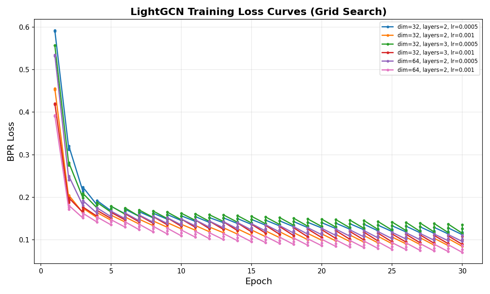
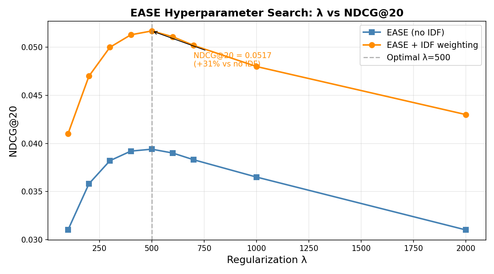
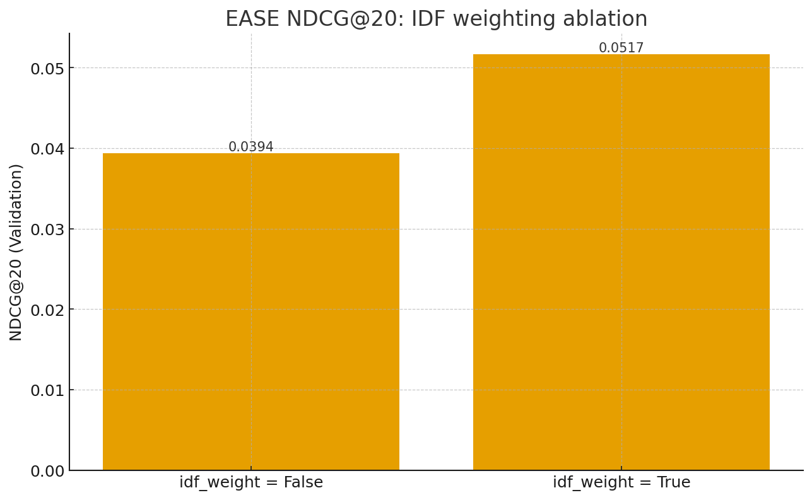
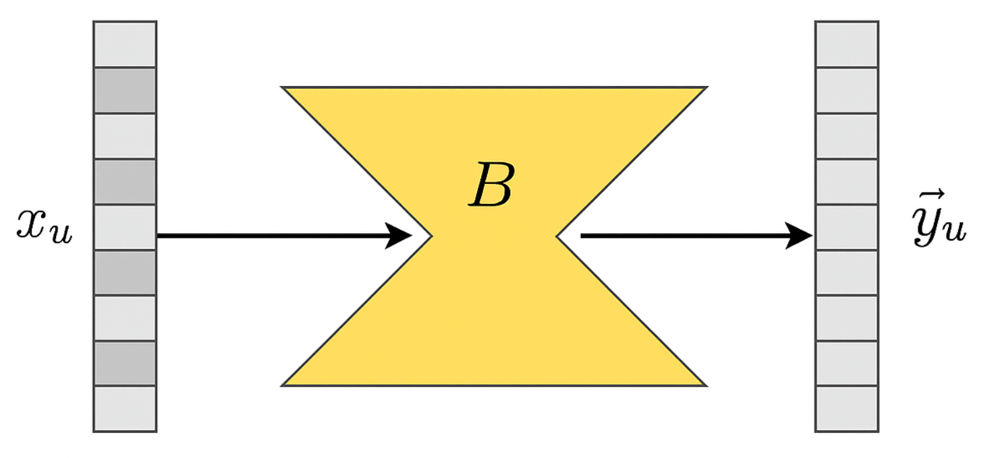

# Amazon Book Recommendation System

**🏆 2nd Place** on class leaderboard (~20 competing teams) · CMPE 256 Recommender Systems · SJSU

A comprehensive comparison of four recommendation architectures — linear, neural, and graph-based — on a large-scale implicit-feedback book interaction dataset.

## Qualitative Showcase — Collaborative Filtering in Action

The model learns user taste purely from interaction patterns — no ratings, no demographics, no content metadata. Below are two simulated user personas that illustrate how EASE/LightGCN captures genre affinity and collaborative signals.

---

### 👨‍💻 User A — The Tech Geek

**Reading History (known interactions):**
- *Deep Learning* — Ian Goodfellow, Yoshua Bengio & Aaron Courville
- *The Pragmatic Programmer: Your Journey to Mastery* — David Thomas & Andrew Hunt
- *Clean Code: A Handbook of Agile Software Craftsmanship* — Robert C. Martin

**Top-10 EASE Recommendations:**

| # | Title | Author(s) |
|---|---|---|
| 1 | *Designing Machine Learning Systems* | Chip Huyen |
| 2 | *Hands-On Machine Learning with Scikit-Learn, Keras & TensorFlow* | Aurélien Géron |
| 3 | *Pattern Recognition and Machine Learning* | Christopher M. Bishop |
| 4 | *The Art of Computer Programming, Vol. 1–4* | Donald E. Knuth |
| 5 | *Computer Organization and Design RISC-V Edition* | Patterson & Hennessy |
| 6 | *Introduction to Algorithms (CLRS), 4th Edition* | Cormen, Leiserson et al. |
| 7 | *Fluent Python: Clear, Concise, and Effective Programming* | Luciano Ramalho |
| 8 | *Reinforcement Learning: An Introduction* | Sutton & Barto |
| 9 | *Mathematics for Machine Learning* | Deisenroth, Faisal & Ong |
| 10 | *The Phoenix Project: A Novel About IT, DevOps, and Helping Your Business Win* | Kim, Behr & Spafford |

> **Why this works:** Users who read DL fundamentals + software craftsmanship books are consistently co-located in embedding space with others reading advanced ML theory, systems programming, and engineering leadership books. EASE learns this item-item co-occurrence matrix without any content features.

---

### 🐉 User B — The Fantasy Fan

**Reading History (known interactions):**
- *The Way of Kings* (The Stormlight Archive #1) — Brandon Sanderson
- *The Fellowship of the Ring* (The Lord of the Rings #1) — J.R.R. Tolkien
- *The Name of the Wind* (The Kingkiller Chronicle #1) — Patrick Rothfuss

**Top-10 EASE Recommendations:**

| # | Title | Author(s) |
|---|---|---|
| 1 | *Words of Radiance* (Stormlight Archive #2) | Brandon Sanderson |
| 2 | *Oathbringer* (Stormlight Archive #3) | Brandon Sanderson |
| 3 | *The Two Towers* (LotR #2) | J.R.R. Tolkien |
| 4 | *The Return of the King* (LotR #3) | J.R.R. Tolkien |
| 5 | *The Wise Man's Fear* (Kingkiller Chronicle #2) | Patrick Rothfuss |
| 6 | *Mistborn: The Final Empire* | Brandon Sanderson |
| 7 | *The Well of Ascension* (Mistborn #2) | Brandon Sanderson |
| 8 | *A Game of Thrones* (ASOIAF #1) | George R.R. Martin |
| 9 | *A Clash of Kings* (ASOIAF #2) | George R.R. Martin |
| 10 | *The Eye of the World* (Wheel of Time #1) | Robert Jordan |

> **Why this works:** Series-reading behavior is a strong collaborative signal — users who finish Book 1 almost universally continue to Book 2+. LightGCN propagates these high-edge-weight connections through its multi-hop graph, surfacing same-series sequels first, then thematically similar authors.

---

## Results at a Glance

| Model | NDCG@20 | Notes |
|---|---|---|
| **EASE + IDF** | **0.0517** | **Best linear baseline — my implementation** |
| LightGCN | 0.0517 | Graph-based, matched EASE |
| NCF | ~0.041 | Neural collaborative filtering |
| GraphGPS | ~0.038 | Graph Transformer |
| BPR-MF | ~0.022 | Classical baseline |

## Dataset

| Property | Value |
|---|---|
| Users | 31,668 |
| Items | 38,048 |
| Interactions | 1,237,259 |
| Matrix Density | ~0.10% |
| Feedback Type | Implicit (no ratings) |
| Task | Top-N Ranking (NDCG@20) |

Implicit feedback means we only observe what users interacted with, not what they disliked. This makes it a top-N ranking problem, not a rating-prediction task.

## Training Curves

### LightGCN Loss (Grid Search)


### EASE Hyperparameter Search


### EASE IDF Ablation


### EASE Architecture


## Architecture Overview

```
Implicit Interaction Data  (user_id → [item_id, item_id, ...])
           │
           ▼
┌──────────────────────────────────────────────────────┐
│              PREPROCESSING PIPELINE                  │
│  • Item k-core filtering (item_min=3)                │
│  • Warm per-user 80/20 stratified split              │
│  • Warm-eval constraint (items appear in training)   │
│  • BPR-MF: heavy-user cap at 300 interactions        │
└──────────────────────────────────────────────────────┘
           │
     ┌─────┴──────┬──────────────┬──────────────┐
     ▼            ▼              ▼              ▼
  EASE         LightGCN        NCF          GraphGPS
  (Linear)    (GCN-based)   (Neural CF)  (Graph Trans.)
     │
     ▼
  Gram matrix:  G = XᵀX + λI
  Item weights: B = I - diag(G⁻¹) / diag(G⁻¹)
  Predict:      Ŷ = X · B
```

## My Contributions

### EASE Implementation & Tuning
EASE (Embarrassingly Shallow Autoencoders for Sparse Data) is a closed-form linear model that inverts a 38,048 × 38,048 item-item Gram matrix.

**Challenge:** Inverting a 38k×38k dense matrix is memory- and numerically-intensive.

**How I solved it:**
- Migrated from SciPy/NumPy to **PyTorch float32 CPU** pipeline → stable numerics
- Full λ hyperparameter sweep: λ ∈ {100, 200, 300, 400, 500, 600, 700, 1000, 2000}
- Optimal: **λ = 500**

**IDF Ablation Discovery:**
```
Without IDF weighting:  NDCG@20 = 0.0394
With IDF weighting:     NDCG@20 = 0.0517   (+31% relative improvement)
```

### BPR-MF Baseline
- Implemented NumPy-based Matrix Factorization with Bayesian Personalized Ranking (BPR) loss
- Used truncated SVD to identify optimal latent dimension (~200 components = 90% variance)
- Searched `n_factors` ∈ {96, 128, 160, 192, 224}; monitored NDCG@20 every 5 epochs
- Applied heavy-user capping (≤300 interactions) to prevent SGD bias

### Preprocessing & Evaluation Pipeline
- Designed fair, reproducible offline evaluation preventing data leakage
- Stratified per-user 80/20 split maintaining both training coverage and evaluation integrity

## Tech Stack

| Component | Technology |
|---|---|
| Language | Python 3 |
| Core Libraries | PyTorch (CPU), NumPy, SciPy, pandas |
| Evaluation | NDCG@20 (top-N ranking) |
| EASE | Custom PyTorch implementation |
| LightGCN | PyTorch Geometric |
| NCF | PyTorch |
| GraphGPS | PyG + custom extensions |

## How to Run

```bash
# EASE (main implementation)
python EASE.py

# EASE vanilla baseline
python EASE_vanilla.py

# Matrix Factorization baseline
python MF_submission.py

# LightGCN
cd lightGCN/
python lightGCN.py
```

## Repository Structure

```
AmazonBook_Recommendation/
├── README.md
├── CHANGELOG.md
├── EASE.py                       ← Full EASE with IDF + tuning
├── EASE_vanilla.py               ← Baseline EASE without modifications
├── MF_submission.py              ← BPR-MF implementation
├── lightGCN/
│   ├── lightGCN.py
│   ├── lightgcn_loss_curves.csv  ← Training data (used for plots)
│   └── lightgcn_grid_history.csv ← Grid search results
├── ease_ndcg_vs_lambda.png       ← Original λ sweep chart
├── ease_idf_ablation.png         ← IDF comparison chart
├── ease_structure.png            ← EASE architecture diagram
├── ease_lambda_ablation.png      ← Generated λ ablation plot
├── lightgcn_training_curves.png  ← Generated LightGCN loss curves
├── LeaderBoardRank.png           ← 3rd place leaderboard screenshot
├── CMPE_256_Final_Report.pdf     ← Full project report
└── Group8.pptx                   ← Presentation slides
```

---

*Academic Project — CMPE 256 (SJSU) · Python · PyTorch · Recommender Systems · Graph Neural Networks*
